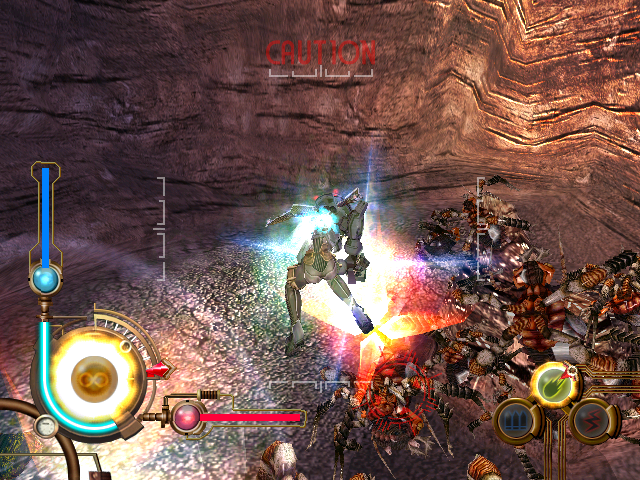

Alternative control scheme for GunValkyrie on the Original Xbox
- Controller Rebind ( A->RB - RB->LS - LS->A )
- Invert RS Y-Axis

Rebind Listing
```
7 14-byte caves

0x00015b35 jmp next

0x00016c51 pushf
0x00016c52 push ecx
0x00016c53 mov ecx,0x234000 ; A
0x00016c5a jmp next

0x00016c81 cmp edx,ecx ; == A
0x00016c83 je ( 00018b95 ) ; RB->A
0x00016c8a jmp next

0x00017951 add ecx,0x10
0x00017954 cmp edx,ecx ; == RB
0x0001795a jmp next

0x00017981 je ( 00018bc1 ) ; LS->RB
0x00017987 add ecx,0x18
0x0001798a jmp next

0x00017b11 cmp edx,ecx ; == LS
0x00017b14 je ( 00018bc6 ) ; A->LS
0x00017b1a jmp next

0x00018b91 mov [edx],eax
0x00018b93 jmp ( 00018bc9 )
0x00018b95 mov byte ptr [ecx+0x10],eax ; RB->A
0x00018b98 jmp ( 00018bc9 )

0x00018bc1 mov byte ptr [ecx+0x18],eax ; LS->RB
0x00018bc4 jmp ( 00018bc9 )
0x00018bc6 mov dword ptr [ecx-0x28],eax ; A->LS
0x00018bc9 add edx,4
0x00018bcc pop ecx
0x00018bcd popf
0x00018bce ret
```
